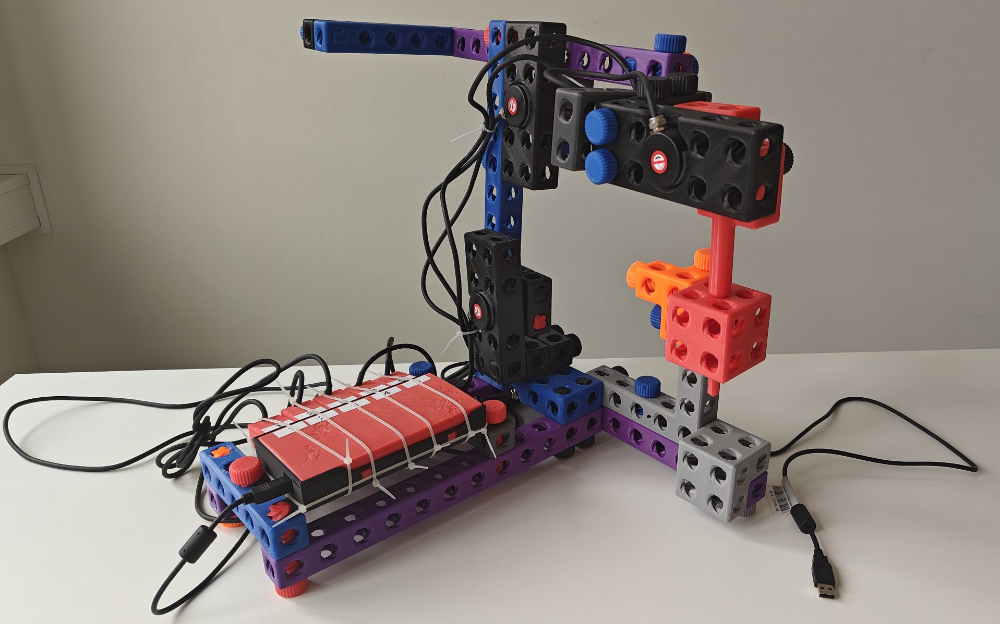

# Open Source Coordinate Measurement Arm

This open source coordinate measurement arm registers the x-, y- and z-coordinate of the pointer by reading the 5 angles of the joints. 

## Project Description

Compared to conventional proprietary CMMs, this one can be extended to fit specific requirements, because it is as open source as possible. No commercial CAD tools are needed. The construction kit approach allows changes without expensive tools like 3d printers. Most parts are parameterized.

### Goals

- fully working coordinate measurement arm
- lowest cost in manufacturing and tools (incl. software)
- easy to build and use
- no legal restrictions (commercial usage allowed, can be produced and sold by everyone)
- no additional power source, USB powered
- safe for unexperienced people, students
- for eduction, research, enhancements 


## Current Status 

- active maintained

## Repository Structure

The structure of this Open Source Hardware repository is based on the [OSH-Design-Guideline](https://iversion.informatik.htw-dresden.de/smartproductionsystems/projects/oshop/osh-design-guideline). It is the root repository for all parts used to build the measurement arm.

The following files are the most important subset needed to build and use the measurement arm:

```
.
├─┬ doc/                            # documentation root 
│ ├─┬ assembly/                     # all assembly related documentation
│ │ └── main.md                     # mechanical assembly instructions
│ └─┬ user/                         # all manuals for the user
│   └── manual.md                   # usage instructions of the fully assembled arm
└─┬ mod/                            # git modules/dependencies root
  ├─┬ elec/                         # electronic parts/pcbs
  │ ├── OSH-CMM-LogicBoard          # main pcb, 1 piece needed
  │ └── rotary-encoder-protection   # pcb in rotary encoder plug, 5 pieces needed
  ├─┬ mech/                         # arm construction elements
  │ ├── Fuzzyometry                 # library for xyzcad used by SpiroBrixx
  │ ├── SpiroBrixx                  # 3d models
  │ └── xyzcad                      # compiles 3d models
  └─┬ mult/                         # repositries with multiple different components
    └── CCM-Arm                     # enhanced third party firmware and host software
```

## Dependencies

All CAD files, software source files and some useful tools can be found in the git submodules in the `mod` directory.

- are referenced as submodules:
    - `xyzcad` implicit surface geometry based CAD software to create the 3d printed parts
    - `Fuzzyometry` implicit chamfer library for `xyzcad`
    - `SpiroBrixx` building blocks for instant mechanical prototyping
    - `cmm-host-software` runs on the host PC to record raw data from the CMM, minimal GUI tool, no visualization
    - `read-rotary-encoder` Arduino software to get data for the `cmm-host-software`
    - `rotary-encoder-protection` electronic in each plug of the rotary encoders to protect the against electrical damage
    - `OSH-CMM-LogicBoard` main electronic board carrying the Arduino, reads the angles of the 5 rotary encoders
    - `CCM-Arm` extended/modified incomplete OSH CMM arm project with visualizing host software and kinematic coordinate calculation firmware; non-commercial open source license

The repository `CCM-Arm` is forked from `BL-Shopwork`.


## License

- Software: "AGPL-3.0-or-later"
- Hardware: "CERN-OHL-S-2.0"

## Author

Stefan Helmert <stefan.helmert@htw-dresden.de>

## Appendix

### Pictures



