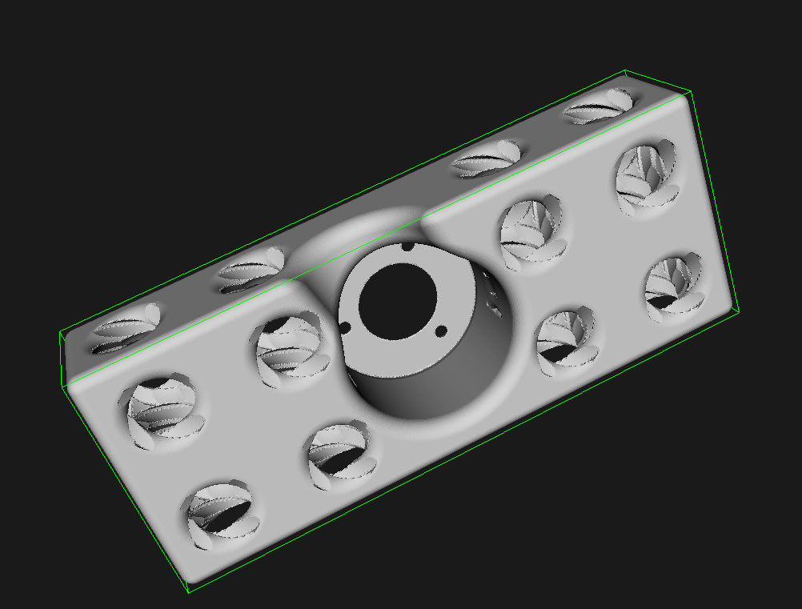

# Arm Assembly

The core strategic asset behind open source instrumentation equipment is the adaptability. This manual shows the basic mounting concept and one possible setup of the arm mechanics. If it is built up with different dimensions, the calibration values in the firmware must be changed!

## Joints

To address the flexibility requirement, there are only a few amount of different parts, which are identical for each joint.

The optical rotary encoders are mounted into the `encodermountI_4` brick by three screws. The screws are normally included with the deilvery of the rotary encoder. There are six holes in the encoder. The three outer holes must be used. There is only one valid position, because the cable must fit into the large notch.

After the screws are tightened, the mounting brackets `notched_screwbarI_4` for the shaft can be fitted. For each encoder two identical parts are used. The notches of the two bricks will embrace the shaft of the encoder. It is easier to align the two parts without the encoder and combine them with one screw at first. There must not be any gap. The two bricks can be rotatetaround the screw like a pair of scissors. The assembly can now be put on the encoder shaft and a second screw must be added. At the end, both screws must be fully tigthened to make sure, the mounting brackets don't move on the shaft. Make sure, there are 1 - 2 mm spacing between the brackets and the three metal screws to avoid scrubbing or blocking.

One joint is ready now. Repeat this procedure for the other four joint.

## Segments

Having more than three joints, allows to turn the pointer to reach the object from different directions. There are multiple different configurations possible.

To describe this configuration, the so called [_Denavit–Hartenberg parameters_](https://en.wikipedia.org/wiki/Denavit%E2%80%93Hartenberg_parameters) are used. Each rotary encoder represents a rotation axis. Each joint is represented by four parameters:

* The position along the first axis `d`
* The angle, measured by the first rotary encoder `Th`
* The radius `r`, where the second axis is located relative to the first axis; It is the length of a line through the both rotation axes, which is ortogonal to the two rotation axes.
* The angle `A` between the two axes

The three parameters `d`, `r` and `A` are calibration values, which must be set in the firmware. Even small errors in this values can lead to completely distorted measurements. This effect is not linear. This means, if a cylinder is measured, it may appear in a shape like a banana.

The following configuration is recommended to have a good combimation of ergonomy and flexibility:

The shaft of the first encoder points upwards. The whole movable part of the arm stands on it. The second encoder is mounted with an angle `A0` of 90° on the shaft. The hight `d0` is not critical. It changes only the absolute z-position of the resulting coordinates. The rotation axes of the first and the second encoder should intersect, that means `r0` should be 0. 

On that shaft, an arm segment in mounted in 90° angle. The third encoder is mounted in the same direction (`A1` = 0°) with 195 mm distance on that segment, parameter `r1`. The distance along the rotation axes is not critical. The fourth encoder is rotated 90° to the third one. The position of it is critical. Its rotation axis of it should intersect the rotation axis of the first (vertical) and the third encoder. If it is out of center, the distance between these two rotation axes must be measured and used as calibration value. 

The distance between the third and the fifth encoder should be 230 mm. The length of the pointer, starting from the last (fifth) encoder rotation axis should be 210 mm. The 3d model of the pointer stick is `screwbarI_4_stick`. It can be put in the `screwbarI_4_hole` to have a reference position, where the incremental rotary encoders are calibrated.

It is recommended to ensure, that all `r` values are 0. The more non-trivial values appear, the higher is the probability, a mistake happens, like noting the wrong sign or confusing the parameters. The reference angles `Th` should be 90°, but the value of the fourth one should be 180°. Mistakes are easier to spot with these values.

