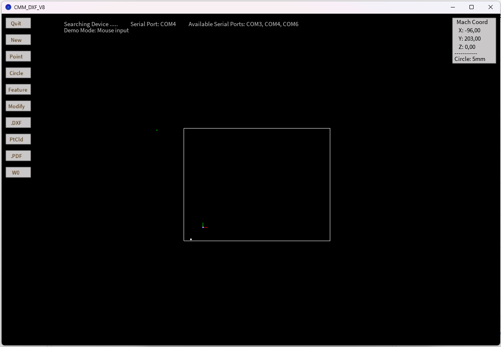
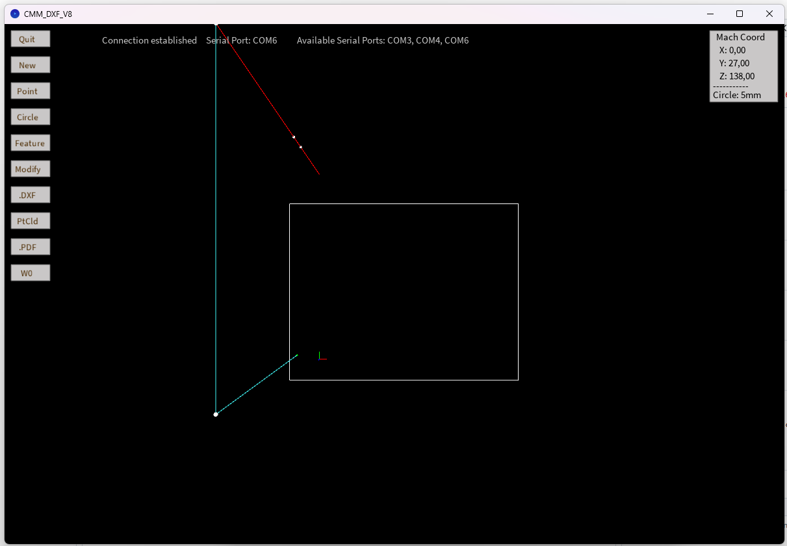

# User Manual OSH-CMM

The measurement arm can only be used as peripheral USB device in compination with a host computer. It is powered by the computer, which also stores the measured values. 

## Setup

The _Java_ software, which collects the data von the host computer needs _Processing_. It is available as a free download: https://processing.org/download and must be installed.

The host software is available on _GitHub_. After downloading the repository https://github.com/TheTesla/CCM-Arm, navigate into the subdirectory `5 DOF/CMM_DXF_V8/` and open `CMM_DXF_V8.pde` with _Processing_. Start the program with the play button.

An interactive window will appear. This is the user interface, which visualizes the measured points.

The host software can be demonstrated without the measurement arm by using the mouse.

Make sure, the pointer of the measurement arm is in the reference position. This is needed to get the best precision. While the arm is in this position, connect the measurement arm to the host computer. Now, an extra serial port should be listed, e. g. `COM6`:

The host software checks all available serial ports, until it finds the measurement arm. When the arm is found, there should be a line drawing of the measurement arm visible in the interactive window, which moves, if the arm is moved:

Now, mouse input is disabled and only the arm data is processed.

## Measure coordinates

Use the pointer of the arm, point it to the position, which should be recorded. Press `.` on the keyboard to record the point and mark it with a dot. To draw lines, start the line with `1` and add corners with `0`. Press `5` to mark a hole.

The recorded data can be stored by clicking `PtCld`. This exports a point cloud file.

## End work

After all the emasurement work is done. The USB cable should be unplugged and the program can be closed by clicking `Quit`. The pointer of the arm should be placed in the reference position to reduce mechanical forces.

